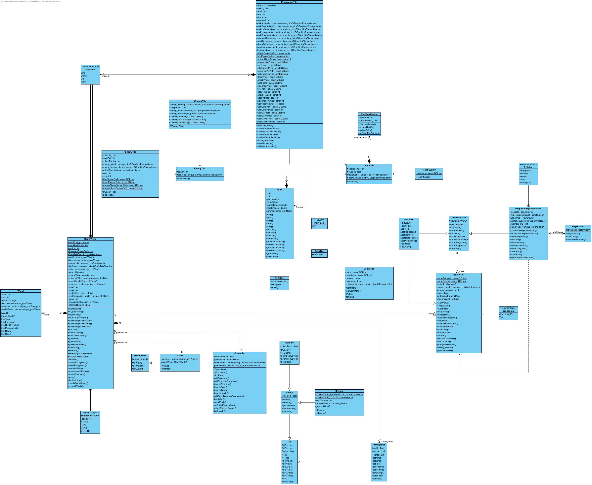

# Dragon Ball Z 2D Game Application

Welcome to the Dragon Ball Z 2D game application, an exciting adventure inspired by the Dragon Ball Z universe. This application is built in C++ using the Qt Framework and features a rich graphical user interface. Dive into the world of powerful characters, and strategic gameplay.

## UML Diagram

Above is the UML diagram generated from the code, providing an overview of the project's structure.

## Key Features

Explore the fantastic features that make this Dragon Ball Z game application an immersive experience:

### Graphical Representation

- **Protagonist Animations**: Witness captivating animations for the protagonist, including idle, movement, attack, healing, poisoning, and dying.

- **Enemy Animations**: Enjoy dynamic animations for enemies, depicting their idle state and dramatic demise.

- **Poisoned Enemy Animations**: Experience unique animations for poisoned enemies, showcasing their idle state, poisoning, and ultimate demise.

- **Xtreme Enemy Animations**: Watch formidable enemies in action with animations for their idle state, attacks, and epic defeat.

### Text Representation (Work in Progress)

- While the primary focus is on the graphical interface, there is ongoing work to provide text-based representation.

### Intuitive Movement

- **Arrow Keys (or WASD)**: Control the protagonist's movement using arrow keys or the WASD keys.

- **Click for Pathfinding**: Easily move the protagonist by clicking on the desired location, and the application will display the path graphically.

### Interactive Terminal

- **Auto Suggest and Complete Commands**: The terminal offers auto-suggestions and command completion by pressing the Tab key.

- **Navigation**: Use arrow keys for movement within the terminal and specify the number of steps.

- **Commands**: Execute various commands, including moving to specific coordinates, attacking the nearest enemy (with an option to target enemies the protagonist can defeat), consuming health packs, displaying the command manual, clearing the terminal, and exiting.

### Handy Shortcuts

- **Ctrl-T**: Quickly open the terminal.

- **Ctrl-S**: Access the settings for customization.

### Autoplay Mode

- In Autoplay mode, the protagonist takes optimal actions each turn, including targeting the strongest enemy and selecting the most suitable health pack.

### Health and Energy Tracking

- Monitor the protagonist's health and energy levels, ensuring you are always ready for battle.

### Poisoned Enemies

- Encounter unique challenges with poisoned enemies that affect surrounding tiles, with the poison's radius expanding until the enemy succumbs.

- Witness visual cues, such as a cloud, and see the protagonist's animated reaction when poisoned.

### Invincible Xtreme Enemies

- Face the formidable Xtreme enemies who become invincible intermittently, adding an extra layer of strategy to battles.

### World Exploration

- Seamlessly switch between different game worlds and explore the map to your heart's content.

- Tune the screen focus on the protagonist or navigate around the map effortlessly.

### Additional Features

- **Edit Settings Dialog**: Customize your gaming experience with the settings dialog, where you can view default world maps, open custom images, and configure the number of enemies and health packs.

- Adjust settings for zoom, animation speed, and pathfinding heuristic weight.

- Discover minor touches like dynamic health label colors and energy bar effects.

### Future Enhancements

- Sound effects for each character and a "God mode" with unlimited energy and health.

### Code Optimization and Design Improvements

- The project continually undergoes optimization and design enhancements to provide you with the best gaming experience.